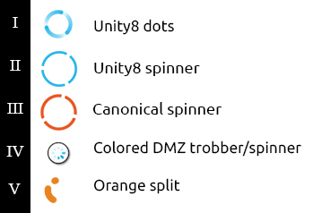
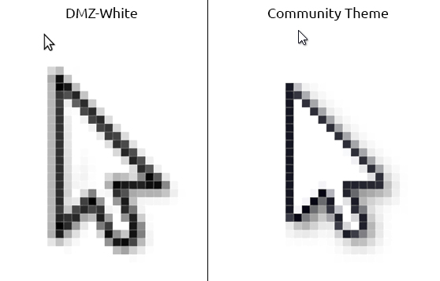

# Yet another DMZ cursor theme

The purpose of this theme is to replace the black/white busy spinner  in the DMZ cursor theme. All icons (except the animated watch spinner icon and the pointer) is inherited from the DMZ-White theme. 

- I: For the blue **Unity8 dots** I have used [this YouTube video ](https://youtu.be/Dwxx2yQs_Ig?t=8m3s) as a reference.
- II: This **Unity8 spinner** came from [the Ubuntu Phone documentation](https://docs.ubuntu.com/phone/en/apps/design/building-blocks/activity-indicators). The space between the lines are transparent.
- III: After creating the spinner above, I came across [the **Canonical design spinner**](http://https://github.com/CanonicalLtd/desktop-design/blob/master/Progress/spinner.svg "the Canonical design spinner"). 
Here I could see that the spaces is not synchronously rotating. Also the space between the lines are white here. This helps give contrast when on a orange or white background.
- IV: **DMZ-colored_trobber** is the standard default DMZ watch spinner, colored blue.
- V: With the **orange split** I am trying a different color. Here an orange dot splitting and assembling while rotating. The #E95420 sometimes looks like red, so this one is slightly more orange.

The pointer has also been replaced and should appear sharper.

### Installation 
To give this a try simply copy the folders to `/usr/share/icons/` and select the cursor theme in Tweaks.

#####Example:
For easy testing, open the terminal inside the *Yet-another-DZM-cursor-theme* folder and paste the following:

`sudo cp -r Communitheme_I Communitheme_II Communitheme_III Communitheme_IV Communitheme_V /usr/share/icons/
`
