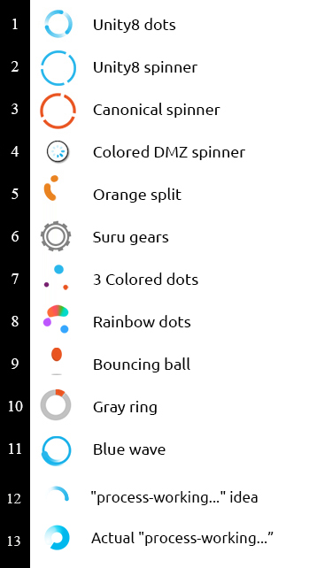

# Yet another DMZ cursor theme

The purpose of this theme is to replace the black/white busy spinner  in the DMZ cursor theme. All icons (except the animated watch spinner icon and the pointer) is inherited from the DMZ-White theme. 

<<<<<<< HEAD
- I: For the blue **Unity8 dots** I have used [this YouTube video ](https://youtu.be/Dwxx2yQs_Ig?t=8m3s) as a reference. 
- II: This **Unity8 spinner** came from [the Ubuntu Phone documentation](https://docs.ubuntu.com/phone/en/apps/design/building-blocks/activity-indicators).
- III: The **orange split** is an orange dot splitting and assembling white rotating.
- IV: **DMZ-colored_trobber** is the standard default DMZ watch spinner, colored blue.
=======
- For the blue **Unity8 dots** I have used [this YouTube video](https://youtu.be/Dwxx2yQs_Ig?t=8m3s) as a reference. 
- The blue spinner looks great but can be difficult to locate on an orange background (which is shiped by default), so the **Unity8 dots with background** adds a white background. This is a solution, but doesn't look very good in practice.
- The **Orange split** is an orange dot splitting and assembling while rotating.
- **DMZ-colored_trobber** is the standard default DMZ watch spinner, colored blue 
>>>>>>> 81b53617deb97c7fd0f8f8be6d7d7146932c0c41

The pointer has also been replaced and should appear sharper.

### Installation 
To give this a try simply copy the _Unity8_dots_ folder to `/usr/share/icons/` and select the cursor theme is Tweaks.
